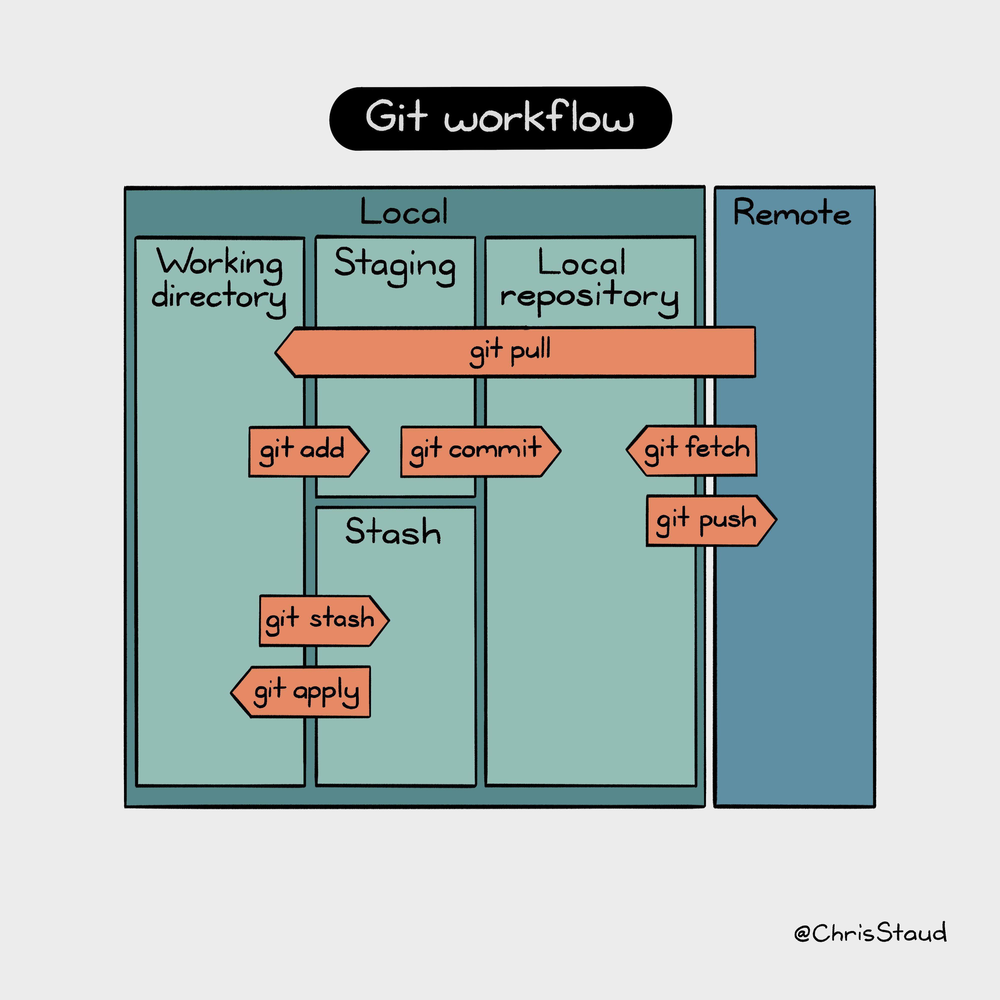

---
jupyter:
  jupytext:
    text_representation:
      extension: .md
      format_name: markdown
      format_version: '1.3'
      jupytext_version: 1.16.7
  kernelspec:
    display_name: teaching
    language: python
    name: python3
marp: true
author: Florian Schunck
title: Version control with git and collaborative software development
paginate: true
theme: uncover
footer: Florian Schunck, 2025-02-17
---

## **Version control** with `git`+`ssh` and **collaborative software development** with `conda`

Florian Schunck

---
### Why do we want to do version control and collaborative software development?

* We can easily distribute code, and revise it, discuss changes, go back in time ⏱ 
* The power of many! Many people can build much better and more stable software than a single person
* **Free backups** 😎 No more loss of code (and manuscripts)
* **Versioning** of software

---
#### Basically the moment you are writing software that you would like to use more than once, you should start thinking about version control

---
### How does git (version control) work?

Transferring files between local and remote places, keeping **copies** of files and updating them incrementally, to have a history of file changes

---
### How does git (version control) work?

+ `git` (https://git-scm.com) is by far the most common tool to do version control. It is usually, but not necessarily, coupled with remote repositories that act as a remote mirror of the local repository such as https://gitlab.uni-onsabrueck.de
+ `git` is a command line tool, this means it is used with the terminal (linux, mac), cmd or powershell (Windows). Whenever you need to understand how git works, it is **help**ful to consult `git --help`

---
### Practice 🛠️

Go to: https://github.com/flo-schu/collaborative-software-development and follow the README

---
### Next: Hands on Git

