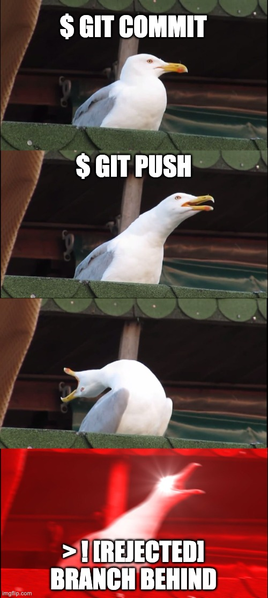
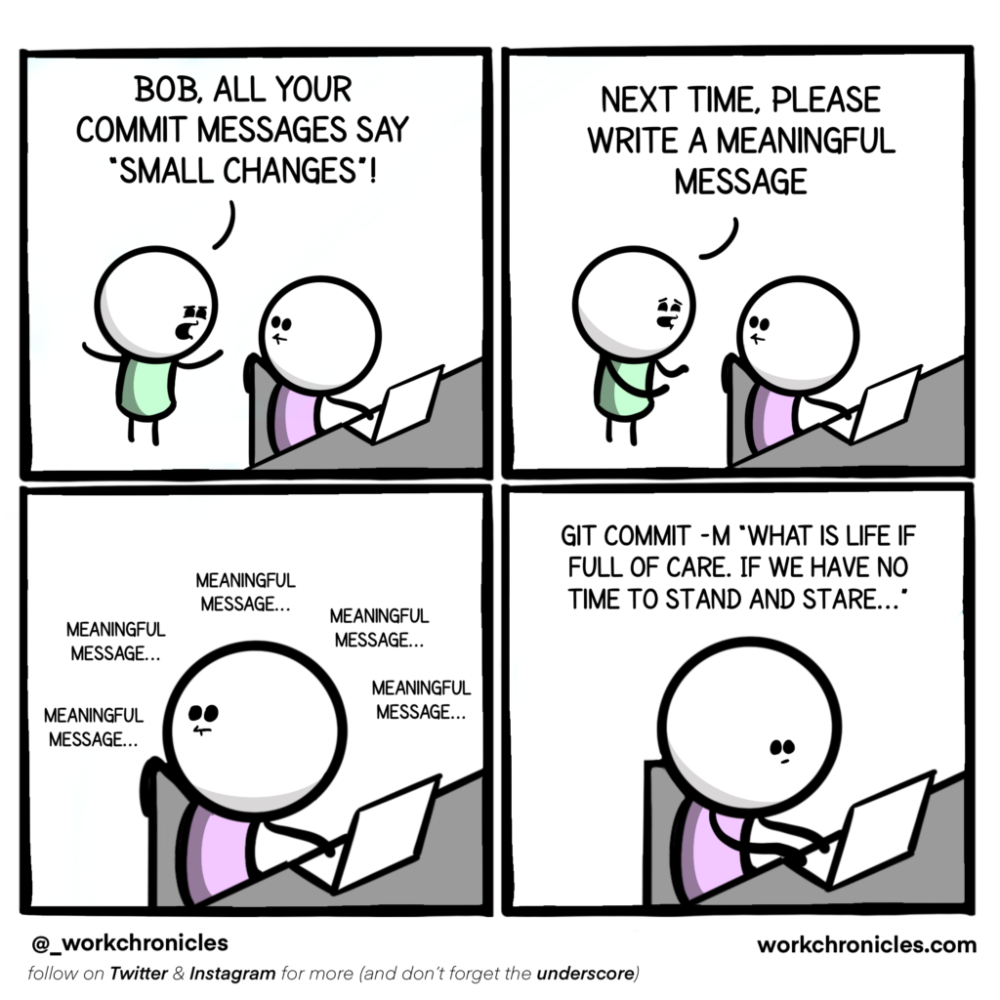
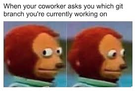

---
jupyter:
  jupytext:
    text_representation:
      extension: .md
      format_name: markdown
      format_version: '1.3'
      jupytext_version: 1.16.7
  kernelspec:
    display_name: teaching
    language: python
    name: python3
marp: true
author: Florian Schunck
title: Version control with git and collaborative software development
paginate: true
theme: uncover
footer: Florian Schunck, 2025-02-17
---

<style>
@import url('css/style.css');
</style>

## **Version control** with `git`+`ssh` and **collaborative software development** with `conda`

Florian Schunck


---
### Practice 🛠️

Go to: https://github.com/flo-schu/collaborative-software-development and follow the README


---
### Explore the local repository

+ `pyproject.toml`: Defines the package, dependencies and makes it installable
+ `.gitignore`: Tells git which files to exclude
+ `main.py`: Here the entry point for the script
+ `csd/`: The package


---
### Explore the remote repository

+ issues
+ branches
+ tags
+ commits


--- 
### Handling an issue

<style scoped>
section {
  font-size: 24pt;
}
</style>

There is an open issue on github: https://github.com/flo-schu/collaborative-software-development/issues/1

By working through the steps in the issue, we will learn the basic concepts of

+ commits
+ pull/push operations
+ branches
+ *testing*
+ merge (pull request, PR)


---
### Commits
<style scoped>
section {
  font-size: 24pt;
}
</style>
<div class="twocols">

Commits are relevant changes to the code. What relevant means is up to you or the software project development guidelines, and is also a matter of practice and a tradeoff between effort and benefit. Ideally, each commit produces a code version that still works, but this is no requirement.

<p class="break"></p>
</div>

---
### Commits
<style scoped>
section {
  font-size: 24pt;
}
</style>
<div class="twocols">
Commits are relevant changes to the code. What relevant means is up to you or the software project development guidelines, and is also a matter of practice and a tradeoff between effort and benefit. Ideally, each commit produces a code version that still works, but this is no requirement.
<p class="break"></p>

 

</div>

---
### Commits
Commit messages should be meaningful




---
### Pull/Push

Pulling and pushing updates your local code from upstream (remote) changes or the remote code from downstream (local) changes


---
### **Issues** keep track of problems or desired changes in the code

Issues are reports that can be made by users of the code or developers of the code to be tackled to fix bugs, improve functionality, document code, .... 

Basically it is a task list so that code developers can pick *issues* one by one and improve the code


---
### **Branches** keep projects organized

Branches **keep the code organized** and facilitate co-development. Why? Because you can push and pull as you like and not mess up somebody's code (or have your code messed up by another person). 

It is good practice to create a branch for every issue


---
### **Branches** keep projects organized



---
### Why **test** code?

+ to test whether your changes work as expected
+ and if your changes have affected other behavior of the code. I.e. everything else still works

Testing can be automatized and is very helpful in larger software projects.


---
### **Merge requests** or **Pull requests** (PR)

When you are ready with your feature, bugfix, etc. you can request to merge your changes into the *main* or *development* branch. This can be done locally with 
```bash
git merge <feature-branch> <main-branch>
```

But a much better variant is to ask for a merge (merge/pull request) on the remote repository, have the code reviewed and discuss the changes with co-developers **before** merging.


---
### Questions